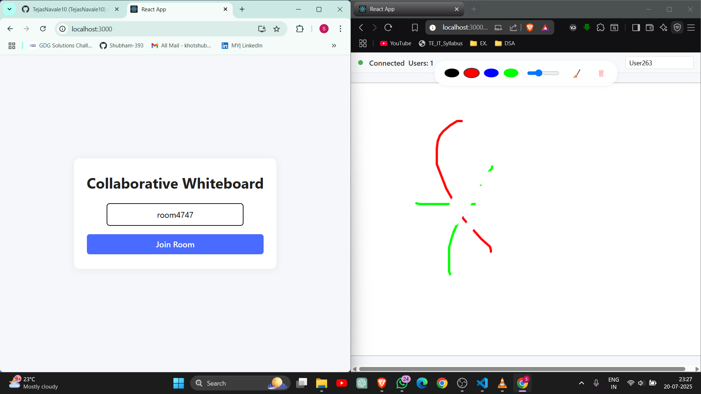
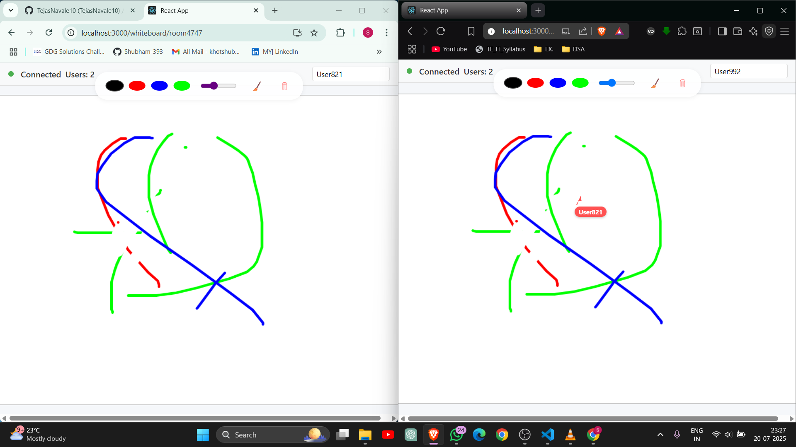

# 🎨 Collaborative Whiteboard

<div align="center">


[](https://github.com/TejasNavale10/Collaborative-Whiteboard/graphs/contributors)
[](https://github.com/TejasNavale10/Collaborative-Whiteboard/commits/main)
[](https://github.com/TejasNavale10/Collaborative-Whiteboard/stargazers)


### 🌟 Unleash Your Creativity Together! 

A powerful real-time collaborative whiteboard platform that transforms the way teams brainstorm, teach, and create together. Experience fluid drawing, instant synchronization, and seamless collaboration—all in your browser.

[View Demo](https://drive.google.com/file/d/1rf8X_wvSEcQ_4YQUPES9bVmMUEfzLxRO/view?usp=sharing) · [Report Bug](https://github.com/TejasNavale10/Collaborative-Whiteboard/issues) · [Request Feature](https://github.com/TejasNavale10/Collaborative-Whiteboard/issues)

</div>

## ✨ Highlights

<table>
  <tr>
    <td>
      🚀 Real-time Collaboration
    </td>
    <td>
      🎯 Zero Latency
    </td>
    <td>
      🔐 Secure Rooms
    </td>
  </tr>
  <tr>
    <td>
      🎨 Rich Drawing Tools
    </td>
    <td>
      💾 Auto-save
    </td>
    <td>
      📱 Responsive Design
    </td>
  </tr>
</table>

## 🚀 Quick Start

1. **Clone the repository**
   ```bash
   git clone https://github.com/TejasNavale10/Collaborative-Whiteboard.git
   cd Collaborative-Whiteboard
   ```

2. **Set up the server**
   ```bash
   cd server
   npm install
   # Create a .env file and add your MongoDB URI:
   # MONGODB_URI=your_mongodb_uri
   npm start
   ```

3. **Set up the client**
   ```bash
   cd client
   npm install
   npm start
   ```

## ⚡ Core Features

<details>
<summary>🖌️ Advanced Drawing Tools</summary>

- Multiple brush types and sizes
- Rich color palette with custom color support
- Pressure sensitivity support
- Undo/Redo functionality
</details>

<details>
<summary>👥 Collaborative Features</summary>

- Real-time cursor positions
- User presence indicators
- Custom user names and avatars
- Chat functionality
- Room-based collaboration
</details>

<details>
<summary>� Smart Features</summary>

- Auto-save functionality
- Export to PNG/JPG/SVG
- Infinite canvas
- Touch screen support
- Keyboard shortcuts
</details>

## 🎯 Why Choose Our Whiteboard?

| Feature | Benefit |
|---------|----------|
| ⚡ **Real-time Sync** | Zero-latency updates across all connected users |
| 🔒 **Secure Rooms** | Private, invitation-only collaboration spaces |
| � **Responsive** | Works perfectly on desktop, tablet, and mobile |
| 🎨 **Rich Tools** | Everything you need for effective visualization |
| 💾 **Auto-save** | Never lose your work with automatic saving |
| � **Scalable** | Handles multiple rooms with thousands of users |

## 🛠️ Technology Stack

<div align="center">

### Frontend
[](https://reactjs.org/)
[](https://socket.io/)
[](https://styled-components.com/)

### Backend
[](https://nodejs.org/)
[](https://expressjs.com/)
[](https://www.mongodb.com/)

- **Frontend**
  - React.js
  - Socket.IO Client
  - Styled Components
  - React Router

- **Backend**
  - Node.js
  - Express.js
  - Socket.IO
  - MongoDB

## 📸 Screenshots

<div align="center">
<table>
  <tr>
    <td></td>
    <td></td>
  </tr>
  
</table>
</div>


## 🤝 Contributing

We love your input! We want to make contributing to Collaborative Whiteboard as easy and transparent as possible. Please check our [Contributing Guidelines](CONTRIBUTING.md) for details.

<div align="center">

[](https://github.com/TejasNavale10/Collaborative-Whiteboard/graphs/contributors)

</div>

## 📈 Future Roadmap

- [ ] Voice chat integration
- [ ] Custom templates
- [ ] AI-powered shape recognition
- [ ] Plugin system
- [ ] Collaborative presentation mode


## 🌟 Show your support

Give a ⭐️ if this project helped you!

<div align="center">

### Made with ❤️ by [Tejas](https://github.com/TejasNavale10)

[](https://linkedin.com/in/your-profile)
[](https://your-portfolio.com)

</div>